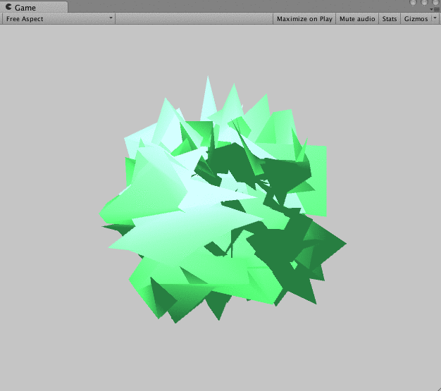

# unity-sound-shock

Shaders that change vertices with sound

This Unity script, `MicAnalyzer`, is designed to attach to a GameObject with an AudioSource component, allowing it to analyze and process audio input from a microphone in real-time.

## Features

- **Real-Time Audio Analysis:** Capture and analyze audio data from the microphone.
- **Volume Control:** Dynamically read and adjust the volume level.
- **Spectrum Analysis:** Break down the audio into low, mid, and high frequencies for further processing.

## How to Use

1. Attach this script to a GameObject in your Unity scene.
2. Ensure the GameObject has an AudioSource component.
3. Configure the sensitivity and frequency thresholds to match your audio analysis requirements.

## Script Functions

- `GetLoundness`: Returns the current loudness level.
- `Start`: Initializes the microphone input and starts capturing audio.
- `Update`: Continuously calculates loudness and analyzes the audio spectrum each frame.
- `CalcLoudness`: Calculates the current frame's loudness.
- `GetAveragedVolume`: Gets the average volume from the current audio clip.
- `AnalyzeSpectrum`: Analyzes the audio spectrum and sets the material properties based on the low, mid, and high frequencies.

## Parameters

- `sensitivity`: Adjusts the microphone sensitivity.
- `resolution`: Sets the resolution of the spectrum analysis.
- `lowFreqThreshold`, `midFreqThreshold`, `highFreqThreshold`: Define the frequency ranges for the spectrum analysis.
- `lowEnhance`, `midEnhance`, `highEnhance`: Multipliers for enhancing the respective frequency ranges.

## Customization

You can control the influence of the last frame's loudness and the thresholds for frequency analysis through the public variables provided.

## Materials

The script interacts with the material on the GameObject to visually represent the audio analysis through shader properties.

## Notes

- The script uses the `Microphone` class to start capturing audio.
- It uses `AudioSource.GetSpectrumData` for spectrum analysis with a Blackman-Harris window for smoothing.
- The script assumes that the GameObject's material has shader properties named `_Loudness`, `_LowSpectrum`, `_MidSpectrum`, and `_HighSpectrum` for audio visualization.

Make sure to tailor the script's public variables to fit the audio characteristics of your project.
